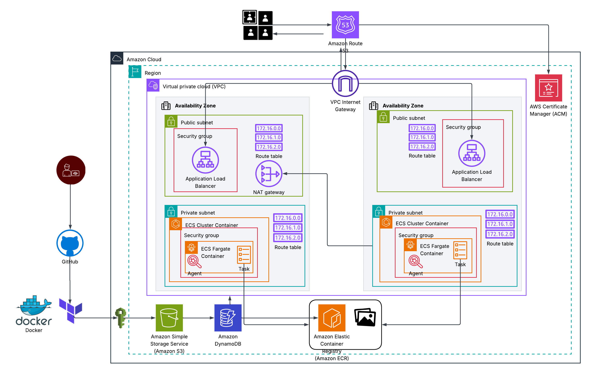
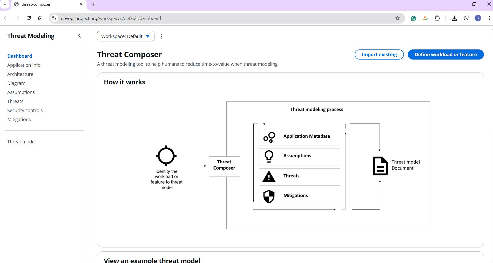
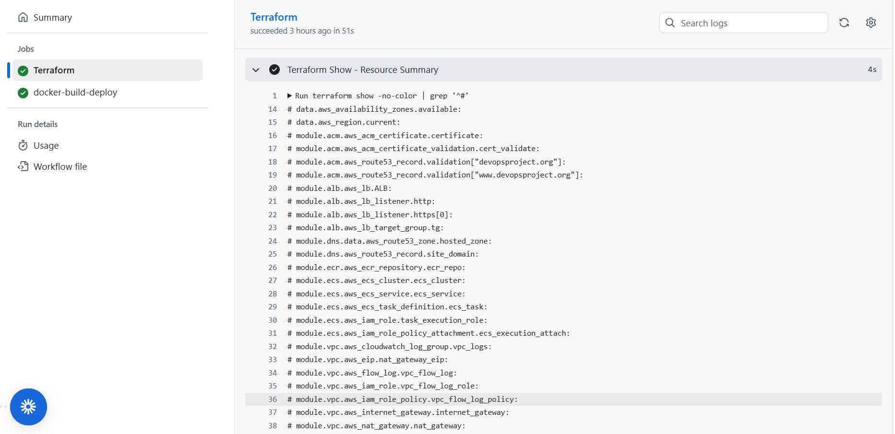
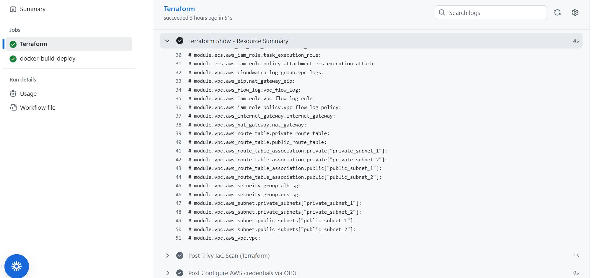

# Threat Composer — Infrastructure as Code (IaC) Deployment
**Threat Composer** is an open-source web application developed by **AWS Labs** for modeling and visualizing cloud threat scenarios. It is built as a React single-page application (SPA) and deploys a two-tier architecture on AWS, with a frontend client layer and backend service/API layer.

🧩 Original Tool: [Threat Composer Tool](https://awslabs.github.io/threat-composer/workspaces/default/dashboard)

🌍 Live Application: [www.devopsproject.org](https://www.devopsproject.org)

📝 Medium Blog: [Threat Composer Medium Blog](https://medium.com/@sajina.tamang99/threat-composer-4b606d5163c0)

## Table of Contents

- [Overview](#overview)
- [Prerequisites](#prerequisites)
- [Tools & Technologies](#tools--technologies)
- [Project Structure](#project-structure)
- [Architecture Diagram](#architecture-diagram)
- [Local Setup](#local-setup)
- [Demo](#demo)
- [Screenshots](#screenshots)

## 1. Overview
Deployed the Threat Composer app on AWS using a secure, scalable, and automated DevOps pipeline. Infrastructure was provisioned with **Terraform**, containerized with **Docker**, stored in **ECR**, and deployed to **ECS Fargate**. A **GitHub Actions CI/CD pipeline** automated build, **trivy security scan**, and deployment. **Route 53** and **ACM** ensured domain management and HTTPS for a cost-efficient, reliable setup.
	
## 2. Prerequisites
Before running this project, ensure the following are available
- ✅ AWS Account with IAM User (programmatic access)
- ✅ AWS CLI configured (aws configure in local system)
- ✅ Terraform installed (via VS Code)
- ✅ GitHub account (fork & clone this repo)
- ✅ Git installed (via VS Code)

## 3. Tools & Technologies

|Category|Tool|Purpose| 
|-----------|----------------|----------|
| IaC (Infrastructure as Code) |Terraform |Automate creation of AWS resources |
| Cloud Provider | AWS | Infrastructure hosting (Fargate, RDS, Route53, ALB, ACM, etc.) |
| Compute | AWS ECS Fargate|Run containerized Node.js application |
| Networking|AWS VPC, Subnets, Security Groups|Secure network segmentation |
| Load Balancing|AWS Application Load Balancer (ALB)|Distribute incoming traffic |
| DNS Management|AWS Route53|Domain management & routing |
| SSL/TLS Certificates|AWS ACM|Secure HTTPS access |
| Container Registry|AWS ECR|Store and version Docker images |
| CI/CD|GitHub Actions|Continuous integration & deployment |
| Security Scanning|Trivy|Container image vulnerability scanning |
| Version Control|GitHub|Source code hosting and collaboration |
| IDE|Visual Studio Code|Development and IaC editing environment |

## 4. Project Structure

```
threat-composer-app/
├── app/                             # Frontend / application source code
│   ├── src/                         # (React or Node app source files)
│   ├── public/                      # Static assets
│   ├── package.json                 # App dependencies and scripts
│   └── ...                          # Other app-related files
│
├── tf_infra/                        # Terraform infrastructure code
│   ├── main.tf                      # Root Terraform configuration
│   ├── variables.tf                 # Variable definitions
│   ├── outputs.tf                   # Output definitions
│   ├── terraform.tf                 # Backend / provider config
│   └── modules/                     # Reusable Terraform modules
│       ├── acm/                     # SSL certificate (ACM) setup
│       ├── dns/                     # Route53 DNS configuration
│       ├── vpc/                     # VPC and networking resources
│       ├── alb/                     # Application Load Balancer
│       ├── ecs/                     # ECS cluster and services
│       └── ecr/                     # Elastic Container Registry
│
├── .github/
│   └── workflows/                   # GitHub Actions CI/CD pipelines
│       ├── main_deploy.yml          # CI/CD pipeline (Terraform + Docker deploy)
│       └── destroy.yml              # Manual teardown (Docker + Terraform destroy)
│
├── .gitignore                       # Git ignore configuration
└── README.md                        # Project documentation
```

## 5. Architecture diagram


## 6. Local Setup

Clone this repository and navigate into the app directory.
You can run the application either with npm (for development) or with Docker (for an isolated runtime).

Using npm: Runs the app in development mode at http://localhost:3000.
```
npm install
npm start
```
Using Docker: If you have Docker installed, you can run the app in a container (no Node.js setup needed). Access it at http://localhost:8080.
```
docker build -t threat-composer-app ./app
docker run -p 8080:80 threat-composer-app
```

## 6. Demo

https://github.com/user-attachments/assets/4210da21-701c-4554-a916-797fcb0c73cd

## 7. Screenshots





